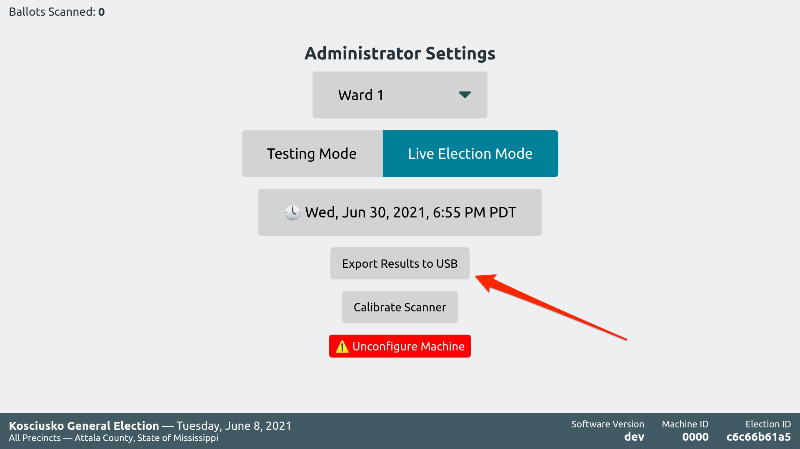

# VxScan Poll Worker Guide

If you have not already set up and turned on the VxScan, follow the instructions to do so:&#x20;


[setting-up-precinct-scanner.md](../hardware-setup/setting-up-precinct-scanner.md)


## Opening Polls

When setting up at the precinct, VxScan should initially show the Polls Closed screen. To open the polls, a poll worker must insert their Poll Worker card into the card reader behind the screen. The Poll Worker card must be facing away from the screen. On the Poll Worker screen that appears, tap `Open Polls for [Precinct Name]` :

Then confirm `Save Report and Open Polls`:

A **Polls Open Report** is saved to the Poll Worker card which should show that no ballots have been scanned. This will also serve as the precinct's **Zero Report**. To print the report, insert the Poll Worker card into a VxMark.&#x20;

On the VxMark's Poll Worker screen that appears, tap `Print Precinct Scanner Tally Report` . Then confirm `Print Report`. Two copies of the report** **will now print from the VxMark's printer in the following format.


Example Polls Open Report


## Casting a Ballot

VxScan is ready to accept a new ballot whenever it displays **Insert Your Ballot Below**.&#x20;

A voter can then insert their ballot directly into the front opening of the scanner. When a ballot is properly inserted, the scanner will grip onto the ballot. If a ballot is inserted at an angle, the scanner may push the ballot back into the voter's hands without scanning, in which case all the voter needs to do is re-insert their ballot. VxScan will then scan the ballot by pulling it inward, and show the following screen:

If the ballot has no errors, the ballot will go into the ballot bag and the screen will show that the ballot has been accepted:

After a few moments, VxScan will return to the "Insert You Ballot" screen in preparation for the next voter. &#x20;

If the ballot was not accepted because of an an issue, the scanner will push the ballot back toward the voter but maintain a grip on it. There could be any of the following issues with the ballot:

### Overvote Ballots

The scanner recognized more than the acceptable number of votes for a particular race. For example, a voter marked two candidates in a race where they must make a single choice. The voter may have not noticed they made two marks for a single race. More commonly, the voter may have made accidental marks on another bubble. VxScan will warn the voter and indicate which races have too many votes:&#x20;

At that point, the voter can pull their ballot away from the scanner. Depending on the applicable laws and regulations, they may void the problematic ballot and mark their votes on a new ballot.&#x20;

The voter could also choose to cast their overvoted ballot despite errors. When they do this, their votes **are counted** in contests for which their ballot has no errors and their votes **are not counted** in contests for which their ballot has errors. For example, if a ballot has too many votes for mayor but is otherwise acceptable, none of the votes for mayor will be counted but the rest of the ballot will be counted normally.

After a ballot is cast and VxScan is done processing it, the screen will return to the normal Polls Open screen and VxScan is ready to accept another ballot.

### Blank Ballots

The scanner did not recognize any choices marked in the bubbles of the ballot. The voter may have circled or underlined the names of their choices instead of filling in the bubbles. Also, the voter may have used a writing utensil whose marks are ignored by the scanner, like a red-inked pen. VxScan will warn the voter that their ballot appears blank:

The voter can then remove their ballot in order to re-mark it or obtain a new ballot to mark.

## Closing Polls

To close the polls, a poll worker must insert their Poll Worker card into the card reader. The card must be facing away from the screen.&#x20;

On the Poll Worker screen that appears, tap `Close Polls for [Precinct Name]`. Then confirm `Save Report and Close Polls`.&#x20;

A **Polls Closed Report** is saved to the Poll Worker card which includes the number of ballots scanned and the tabulated results of those ballots. To print the report, insert the Poll Worker card into a VxMark.

On the VxMark's Poll Worker screen that appears, tap `Print Precinct Scanner Tally Report` . Then confirm `Print Report`. Two copies of the report will now print from the VxMark's printer in the following format.


Example Polls Closed Report


## Exporting Results

Insert the Admin card into the VxScan's card reader to bring up the Admin menu. Then tap the `Export Results to USB` button:

If there is no USB drive detected, VxScan will prompt you to insert a USB drive. Once a USB drive is detected, there will be a pop-up with options to save the results. We recommend choosing the default `Export` option:

The results will then be saved onto the USB drive. Finally, you will be prompted to safely eject the USB before removing it:

You can now safely remove the USB drive from inside VxScan and return it to your election administrators.
