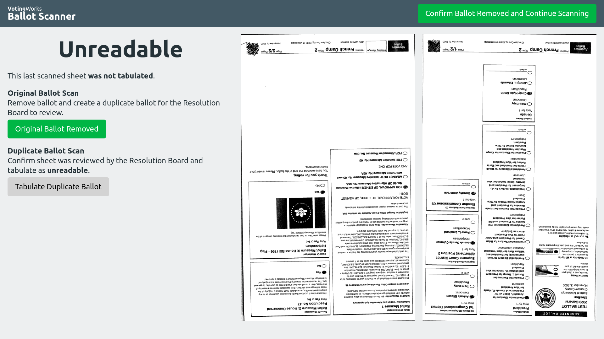

# Central Scanning

VxCentralScan is a central scanning solution that allows you to quickly scan large batches of ballots. If you are using VxScan at your precincts, then you'll use VxCentralScan to scan absentee and affidavit ballots. If you are not using VxScan at your precincts, then you'll use VxCentralScan to scan all ballots.

Follow the [VxCentral Scan Hardware Setup](../central-system-setup/vxcentralscan-hardware-setup.md) instructions to prepare the system for use.

## Scan Ballot Batches

Before scanning the first ballot batch, confirm that VxCentralScan displays No ballots have been scanned. If no, go to the Admin menu and select _`Delete Ballot Data`_ to clear the scanner.

 (1).png>)

Load a stack of ballots into the feeder tray of the scanner. VotingWorks recommends loading no more than 50 ballot sheets at at time. The ballots need to be in a neat stack, unfolded and lying flat, but ballots can be in any orientation (e.g. upside down or backwards is fine).

Select _`Scan New Batch`_. Ballots feed through the scanner automatically and the number of ballots scanned will increase as each ballot is scanned under Ballot Count. A timestamp will appear under the Finished At header when a batch is done scanning.&#x20;

.png>)

Once the batch finishes scanning, remove it from the output tray on the scanner and place the next stack of ballots in the feeder tray. Repeat the scanning process until all ballots are scanned.

.png>)

## Adjudicate Ballots

VxCentralScan will stop scanning and present a review screen if scanning cannot be completed due to a blank sheet, overvoted contest, scan mode mismatch, or an otherwise unreadable ballot sheet. The review screen will display an image of the scanned ballot sheet, the reason why scanning was stopped, and confirm that this ballot sheet has not been tabulated yet.

### Blank & Overvoted Ballots

#### **Original Ballot Scan**

If scanning an original voter-marked ballot, remove the last ballot sheet scanned from the scanner output tray and confirm it matches the ballot sheet displayed onscreen. Once removed, select _`Original Ballot Removed`_ and confirm by selecting _`Confirm Ballot Removed and Continue Scanning`_. Once confirmed, the scanner will resume scanning ballots in the batch.&#x20;

The example below shows an **Overvote** detected that is being removed for Resolution Board processing.

The removed ballot should be duplicated and prepared for the Resolution Board. Using a red pen, mark the removed ballot as Original and the duplicated ballot as Duplicate with both ballots numbered consecutively. For example, the first ballot removed should be marked as Original #1 and the ballot used for duplication as Duplicate #1. Place both the original and duplicate ballots in an envelope to provide to the Resolution Board.

The Resolution Board will examine the original ballot and mark the duplicate ballot in a manner consistent with the voter’s intent and applicable laws. When all original ballot batches have been scanned, a final batch containing all the duplicated ballots may be scanned to reincorporate these ballots into the tally.

#### **Duplicate Ballot Scan**

If scanning a duplicated ballot prepared by the Resolution Board, first confirm that the reason presented on screen is valid and that the duplicate ballot should be tabulated as such. VotingWorks recommends scanning all duplicate ballots as the last batch on election night.

To tabulate the duplicate ballot, select _`Tabulate Duplicate Ballot`_ and then _`Tabulate Ballot and Continue Scanning`_. The duplicate ballot will be recorded with the condition shown on screen and the scanner will continue scanning the remaining ballots in the batch.

The example below shows a **Blank Ballot** duplicated by the Resolution Board that is being tabulated as a blank ballot.

### Unreadable Ballots

VxCentralScan may show an **Unreadable** ballot screen for a properly marked ballot if it's unable to decode ballot information due to page skew, dust, or tampering of the ballot. When a ballot sheet is shown as unreadable, you can safely remove the ballot and re-scan the ballot sheet. If the ballot is unreadable on a second scan, you should remove the ballot and prepare a duplicate ballot for the Resolution Board to review.

### Mode Mismatch

A mode mismatch error will appear if the scanner mode (Test or Official) does not match the ballot type (Test or Official) and the scanned sheet will not be tabulated. In these cases, you should either remove the ballot from the stack or switch scanner modes.

The example below shows a Test ballot that was scanned in Live mode.

## Exporting Cast Vote Records (CVRs)

When all ballot batches (including any duplicated ballots) have been scanned, you will need to export the CVRs from VxCentralScan to load into VxAdmin for tabulation.

To export, select _`Export`_ in the top right.

 (1).png>)

You'll be prompted to insert a USB drive. Once recognized, select _`Export`_ again.

.png>)

You don't need to worry about filenames. The export process takes care of that.

Once you've selected Export, you'll see a confirmation screen, select _`Eject USB`_.

 (1) (1).png>)

Then, you can physically remove the USB drive that now holds the CVR file.

If using multiple VxCentralScan stations, repeat for each one.

### Export Backup

After exporting the CVR, VotingWorks recommends also taking a backup of all data from the VxCentralScan station. To export a backup, navigate to the Admin menu and select _`Export Backup`_. Then navigate to the USB drive in the file dialog and save the backup .zip file. The file may take up to a few minutes to save.

.png>)

Once saved, select _`Eject USB`_ and remove the USB drive from VxCentralScan.
